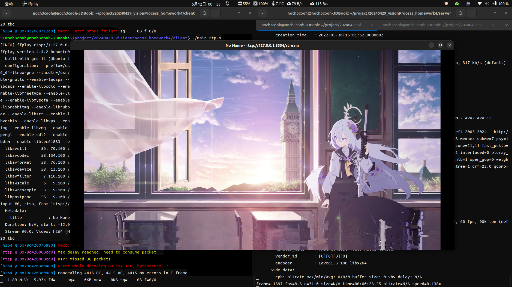

# 基于 socket 的 TCP、RTP 视频传输对比
21009102148 黄陈智博

## 1 实验目标

应用视频传输协议 RTP，分别通过 TCP、UDP协议传输视频，并对比视频传输质量（时延、卡顿、视频质量）。

## 2 实现方案

### 2.1 总体方案

应用 ffmpeg、ffplay 和开源软件 mediamtx，分别构建基于 UDP、TCP 的视频流
* RTP 默认基于 UDP，此处直接推 RTP 流
* 由于未知原因，ffmpeg 无法通过 TCP 推 RTP 流，故此处使用开源软件 mediamtx 构建 RTSP 服务器并使用 ffmpeg 推 RTSP 流替代。
* 分别通过两种协议推不同常用分辨率的视频流，观察视频传输质量，并测量以下参数分析：

1. 时延：通过程序开始运行到程序显示画面的时间定量；
2. 卡顿：通过视频帧率定量；
3. 视频质量：观察视频是否有出现明显画面撕裂。

### 2.2 实验环境

* CPU：intel i3-1115g4
* 内存：16GB
* 操作系统：Ubuntu 22.04
* 传输链路：localhost(127.0.0.1)

### 2.3 编译命令

本次实验分为两个文件夹 server、clinet，分别在两个文件夹的终端内输入
```shell
g++ main.cpp -o main.o
```

随后输入该命令即可运行：

```shell
./main.o
```

## 3 实现结果

|分辨率|时延（TCP）|帧率（TCP）|是否有画面撕裂（TCP）|时延（UDP）|帧率（UDP）|是否有画面撕裂（UDP）|
|:-:|:-:|:-:|:-:|:-:|:-:|:-:|
4K|17s|8.3|是|34.4s|7.2|是|
2K|13s|21|否|10.43s|19|否|
1080p|6.4s|35|否|7.36s|40|否|
720p|4.86s|59|否|2.82s|59|否|
480p|2s|58|否|1.31s|59|否|

_注：源视频文件均为60帧视频_

以上为实验测得结果，我们可发现同等分辨率情况下 UDP 协议的传输效果大致好于 TCP 协议。例如 1080p 下，虽然时延 UDP 协议多余 TCP 协议，但可认为是误差，通过 UDP 传输的视频帧率是高于通过 TCP 协议传输的。且在更低分辨率下，此时帧率均相近，达到了源视频的极限，但是时延 UDP 协议总体低于 TCP 协议。

当然，TCP协议也不是没有优点，其三次握手能够极大地保证数据的稳定传输。可见在 4K 分辨率下，不管基于何种协议，传输画面均出现了一定程度的撕裂，以下为通过 TCP 协议传输的视频其中的一帧撕裂的画面：



以下为通过 UDP 协议传输的视频其中的一帧撕裂的画面：


我们可以明显看出通过 TCP 协议传输的视频画面撕裂少于通过 UDP 协议传输的。
可见在数据量过大时，TCP 协议的特性能够尽量降低数据传输出错的概率。

## 4 收获心得

本次实验对TCP、UDP协议的特性有了清楚的认识，并通过对比实验探究出了这两种协议在视频传输场景的效果。
